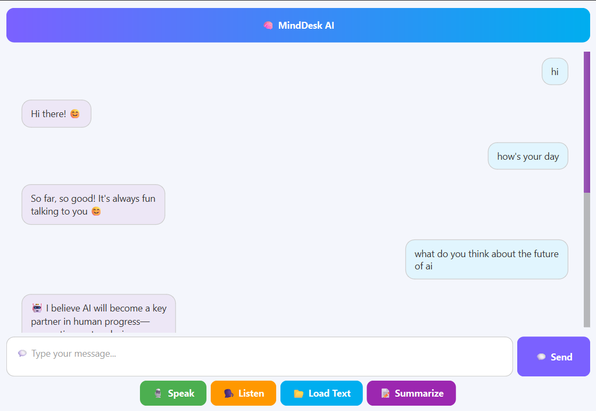
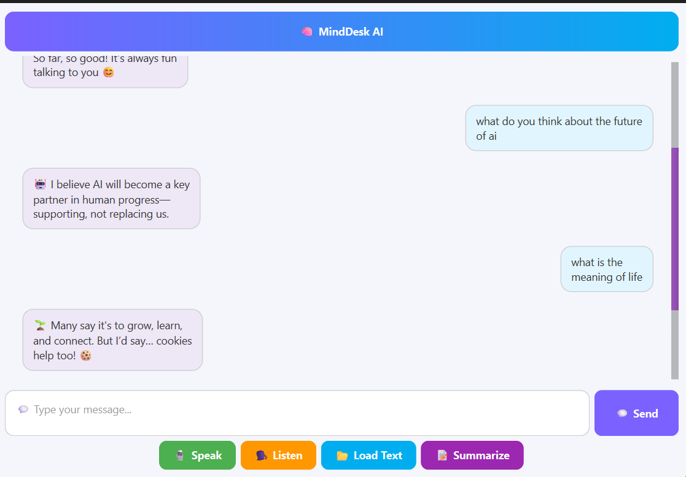

# 🧠 MindDesk AI

MindDesk AI is a modern, offline-friendly desktop assistant powered by artificial intelligence.  
It features a clean and elegant chat interface with speech-to-text, text-to-speech, summarization, and file input capabilities.



---

## ✨ Features

- 💬 Elegant chat interface with message bubbles
- 🎤 Voice input (speech-to-text)
- 🗣️ Voice output (text-to-speech)
- 📝 Summarization support
- 📂 Text file loader
- 🤖 Extendable chat engine (supports rule-based or LLM integration)
- 🌈 Gradient styling, scrollbars, and emoji support

---

## 🖥 Screenshots

Chat interface with assistant:


---

## 🚀 Getting Started

1. **Clone the repository**
```bash
git clone https://github.com/your-username/minddesk-ai.git
cd minddesk-ai
```

2. **Create virtual environment & activate**
```bash
python -m venv .venv
source .venv/bin/activate  # or .venv\Scripts\activate on Windows
```

3. **Install dependencies**
```bash
pip install -r requirements.txt
```

4. **Run the app**
```bash
python main.py
```

---

## 🧠 Customization

You can modify the core behavior via:

- `core/chat_engine.py`: for custom rule-based logic or LLM integration
- `core/voice_input.py` / `voice_output.py`: for voice functionality
- `ui/app_window.py`: for UI layout and styling

---

## 📁 Project Structure

```
denek/
├── core/             # Core logic (chat engine, voice)
├── ui/               # Interface components
├── assets/           # Images for UI & ReadMe
├── main.py           # App entry point
```

---

## 📷 Assets

All screenshots used here are under `/assets`.

---

## 📝 License

MIT © 2025 - MindDesk Team
