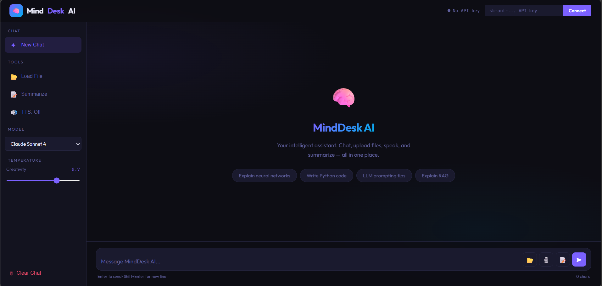
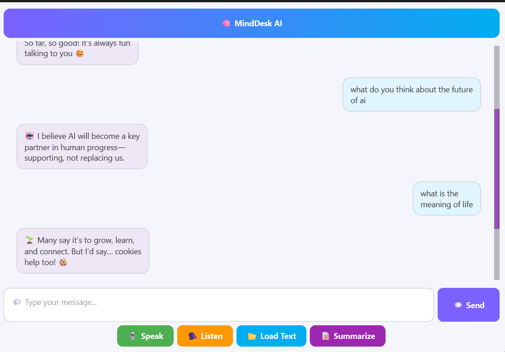
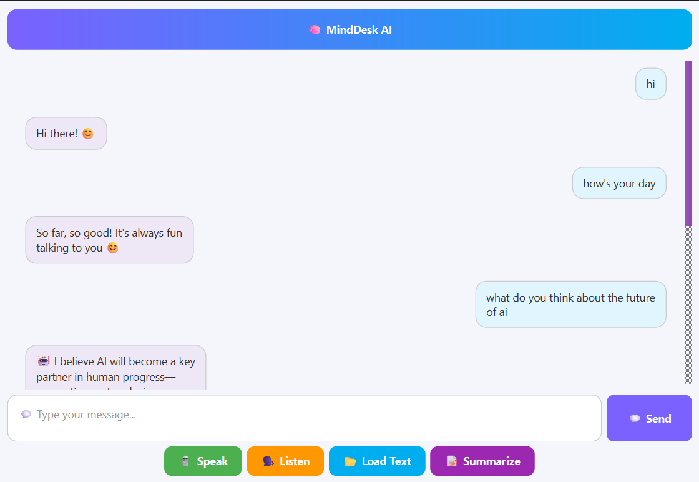

# 🧠 MindDesk AI

MindDesk AI is a modern, offline-friendly desktop assistant powered by artificial intelligence.  
It features a clean and elegant chat interface together with a modern web interface, offering speech-to-text, text-to-speech, summarization, and file input capabilities.

---

## ✨ Features

- 💬 Elegant chat interface with message bubbles
- 🌐 Modern web interface
- 🎤 Voice input (speech-to-text)
- 🗣️ Voice output (text-to-speech)
- 📝 Summarization support
- 📂 Text file loader
- 🤖 Extendable chat engine (supports rule-based or LLM integration)
- 🌈 Gradient styling, scrollbars, and emoji support

---

## 🖥 Screenshots

Web interface:  

Chat interface with assistant:  

Desktop interface:  

---

## 🚀 Getting Started

1. **Clone the repository**

    git clone https://github.com/altanulaszohre/MindDesk-AI.git
    cd MindDesk-AI

2. **Create virtual environment & activate**

    python -m venv .venv
    source .venv/bin/activate  # or .venv\Scripts\activate on Windows

3. **Install dependencies**

    pip install -r requirements.txt

4. **Run the app**

    python main.py

---

## 🌐 Running the Web Version

Open the web interface directly in your browser:

    web/index.html

or run a local server:

    python -m http.server

then visit:

    http://localhost:8000/web

---

## 🧠 Customization

You can modify the core behavior via:

- `core/chat_engine.py`: for custom rule-based logic or LLM integration
- `core/voice_input.py` / `voice_output.py`: for voice functionality
- `ui/app_window.py`: for UI layout and styling
- `web/index.html`: for the web interface

---

## 📁 Project Structure

    MindDesk-AI/
    ├── core/             # Core logic (chat engine, voice)
    ├── ui/               # Interface components
    ├── web/              # Web interface
    ├── assets/           # Images for UI & ReadMe
    ├── main.py           # App entry point
    └── README.md

---

## 📷 Assets

All screenshots used here are under `/assets`.

---

## 📝 License

MIT © 2025

***Altan Ulaş Zöhre***
